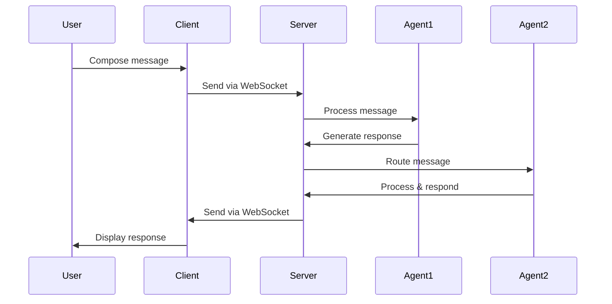
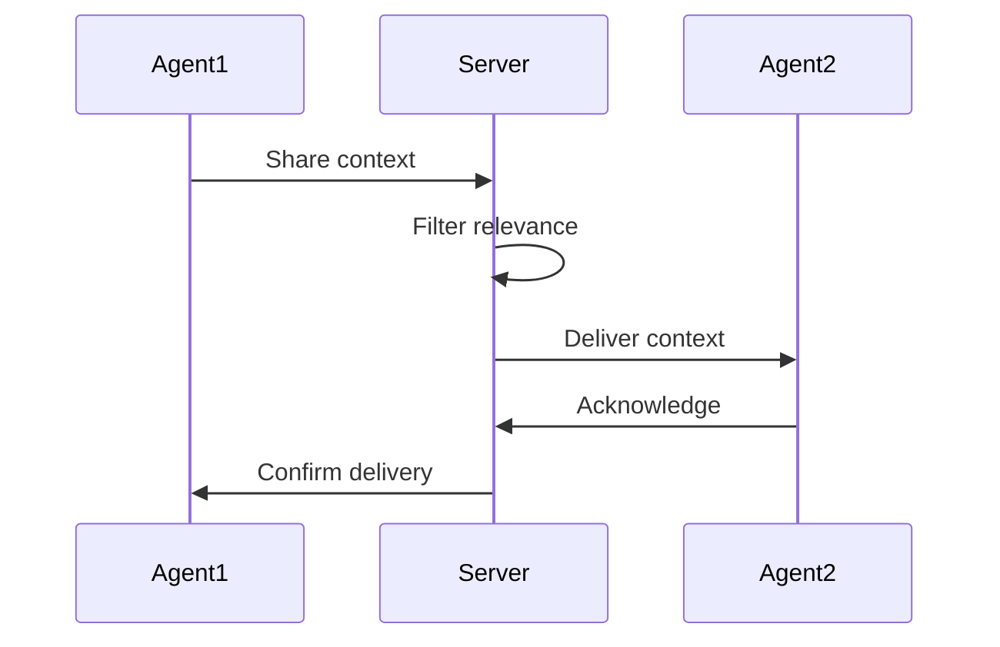
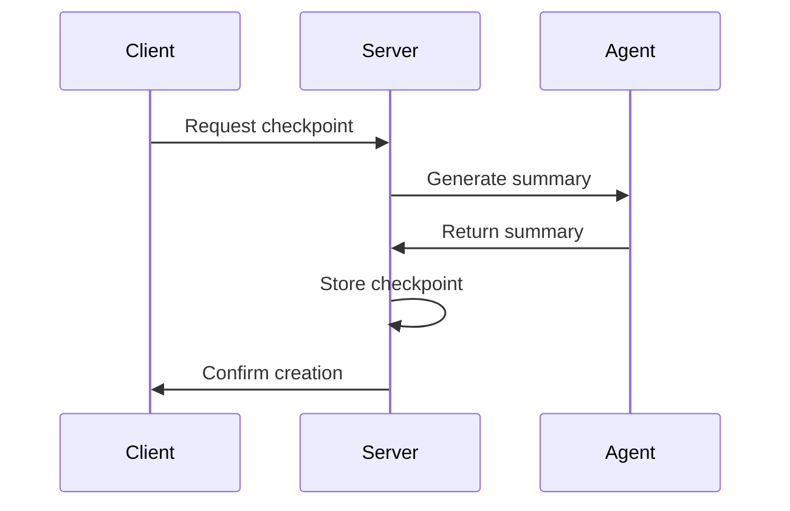
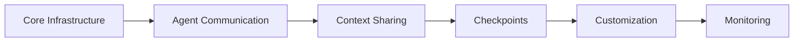

# A2A Protocol Implementation Strategy

This document outlines the strategy for implementing the Agent-to-Agent (A2A) protocol in our multi-agent chat system using a server/client architecture running locally.

## Architecture Overview

The system follows a strict server/client architecture where:

1. Server (FastAPI + PostgreSQL)
   - Handles all data persistence
   - Manages agent communication
   - Processes A2A protocol messages
   - Collects metrics and analytics

2. Client (React + TanStack Query)
   - Provides user interface
   - Manages client-side state
   - Handles real-time updates
   - Visualizes metrics and analytics

## Implementation Approach

The implementation is divided into six feature slices, each building upon the previous ones:

### 1. Core Infrastructure (Feature Slice 1)
- Database schema for agent cards and A2A tasks
- Server-side services for task management
- Client-side API integration with React Query
- Basic error handling and monitoring

### 2. Agent Communication (Feature Slice 2)
- WebSocket-based real-time communication
- Message routing between agents
- Client-side message composition
- Error recovery and reconnection

### 3. Context Sharing (Feature Slice 3)
- Selective context sharing between agents
- Context relevance filtering
- Context expiration management
- Client-side context visualization

### 4. Conversation Checkpoints (Feature Slice 4)
- Automatic and manual checkpoint creation
- Checkpoint-based summarization
- Checkpoint management and retrieval
- Client-side checkpoint visualization

### 5. Communication Customization (Feature Slice 5)
- User-configurable communication rules
- Agent relationship management
- Communication style settings
- Client-side configuration UI

### 6. Monitoring and Analytics (Feature Slice 6)
- Comprehensive metrics collection
- Performance monitoring
- Usage analytics
- Client-side dashboards

## Data Flow

1. Message Flow

2. Context Sharing

3. Checkpoint Creation

## State Management

1. Server-Side State
- PostgreSQL for persistent storage
- Redis for caching (future optimization)
- In-memory state for active connections

2. Client-Side State
- TanStack Query for server state
- React Context for UI state
- Local storage for preferences

## Error Handling

1. Network Errors
- Automatic reconnection
- Message queuing
- State recovery

2. Processing Errors
- Retry mechanisms
- Fallback behaviors
- Error boundaries

3. Data Errors
- Validation
- Sanitization
- Recovery procedures

## Performance Considerations

1. Real-time Communication
- WebSocket connection pooling
- Message batching
- Selective updates

2. Data Management
- Query optimization
- Efficient caching
- Pagination

3. UI Performance
- Component memoization
- Virtual scrolling
- Lazy loading

## Security Measures

1. Input Validation
- Server-side validation
- Client-side sanitization
- Type checking

2. Data Protection
- Secure WebSocket connections
- Input sanitization
- Error message sanitization

## Monitoring Strategy

1. Performance Metrics
- Response times
- Resource usage
- Error rates

2. Usage Analytics
- Agent interactions
- Feature usage
- Error patterns

3. System Health
- Connection status
- Database health
- Memory usage

## Development Workflow

1. Implementation Order

2. Testing Strategy
- Unit tests for each component
- Integration tests for features
- End-to-end tests for flows
- Performance testing

3. Deployment Process
- Local development setup
- Testing environment
- Production deployment

## Success Metrics

1. Technical Metrics
- Response time < 100ms
- WebSocket latency < 50ms
- Error rate < 1%
- CPU usage < 50%

2. User Experience
- Real-time updates
- Intuitive interface
- Clear error messages
- Smooth interactions

3. Code Quality
- Test coverage > 80%
- Clean architecture
- Clear documentation
- Maintainable code

## Next Steps

1. Implementation
- Set up development environment
- Implement core infrastructure
- Add communication features
- Build monitoring system

2. Testing
- Write test suites
- Perform load testing
- Conduct security audit
- User acceptance testing

3. Documentation
- API documentation
- Setup guides
- User guides
- Maintenance procedures

4. Deployment
- Configure environments
- Set up monitoring
- Establish backup procedures
- Plan scaling strategy
